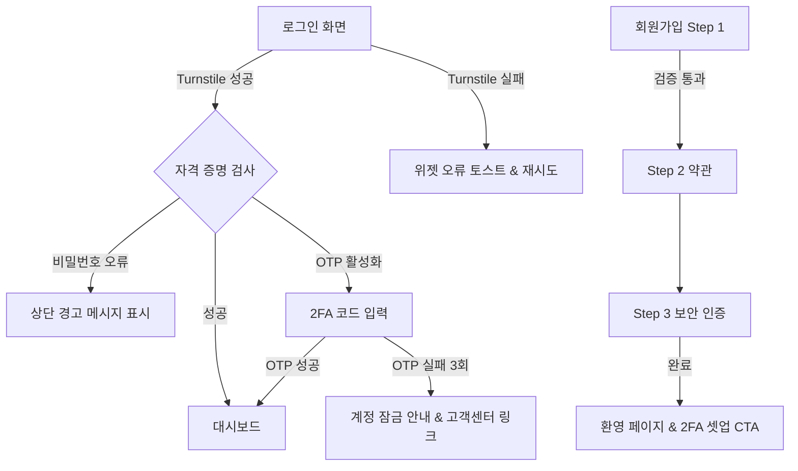

# 인증 UI 와이어플로 & UX 가이드

## 1. 목적
- 단계 1(Task2) 범위인 로그인/회원가입/비밀번호 재설정 흐름의 화면 구조와 UX 지침을 정의한다.
- Cloudflare Turnstile 및 2FA 안내 메시지를 포함한 오류/예외 처리 정책을 문서화한다.
- 관리자·사용자 공통으로 활용 가능한 컴포넌트 조합과 카피 톤을 정리한다.

## 2. 공통 원칙
- 단일 열 레이아웃을 기본으로 하고, Desktop에서는 좌우 분할(브랜드 비주얼 + 폼)이 가능하다.
- `tokens/components.json`의 `button`, `input`, `toast` 토큰을 사용하며, 포커스/에러 상태는 토큰 정의를 따른다.
- 모든 폼 요소는 키보드 탐색(Tab/Shift+Tab) 시 포커스 링(`colors.palette.focus`)을 표시한다.
- Turnstile 위젯은 Submit 버튼과 동일 폼 박스 내에 배치하며, 오프라인/로딩 상태에 대한 비주얼 피드백을 제공한다.

## 3. 주요 화면 구조

### 3.1 로그인(Login)
- **헤더/브랜드 영역**: 로고, 제품 슬로건, 지원 링크(FAQ).
- **입력 필드**: 이메일/아이디, 비밀번호. 각각 프라이머리 라벨 + 헬퍼 텍스트 슬롯.
- **Turnstile 박스**: 입력 필드와 Submit 버튼 사이에 삽입. 상태별 메시지:
  - `검증이 완료되었습니다`(성공)
  - `로딩 중…`(검증 진행)
  - `인증을 다시 시도해주세요`(오류)
- **보조 액션**: `비밀번호 재설정`, `회원가입` 텍스트 링크.
- **상태 메시지**: 로그인 실패 시 상단 경고 배너(`toast` 스타일)로 노출.

### 3.2 회원가입(Sign-up)
- **Progress indicator**: Stepper(1. 정보 입력 → 2. 약관 동의 → 3. 보안 인증).
- **필수 항목**: 이름, 이메일, 비밀번호, 추천코드(옵션), Turnstile.
- **2FA 안내**: 가입 완료 후 2FA 설정을 유도하는 Highlight 카드.
- **약관/동의 영역**: 체크박스 리스트 + `전체 동의` 토글.
- **모바일**: Accordion으로 약관 본문 접기/펼치기.

### 3.3 비밀번호 재설정(Forgot Password)
- **입력**: 등록 이메일.
- **Turnstile**: 제출 전 검증 필수.
- **성공 메시지**: `재설정 링크를 이메일로 전송했습니다` + 10분 이내 유효 안내.
- **오류**: 미등록 이메일 → `계정이 존재하지 않습니다. 가입 여부를 확인하세요`.

## 4. 와이어플로 개요

## 5. Turnstile UX 지침
- **위치**: 버튼 바로 위, 폼 폭과 동일하게 중앙 정렬.
- **로딩 상태**: skeleton shimmer + `Turnstile을 준비 중입니다` 메시지.
- **오류 시나리오**
  - 네트워크 오류: `보안 검증에 실패했습니다. 네트워크를 확인한 뒤 다시 시도해주세요.` (Retry 버튼 제공)
  - 잘못된 토큰: 토큰 재요청 → 자동으로 새 위젯 로드, 실패 시 모달로 고객센터 안내.
- **접근성**: Turnstile iframe에 `title="보안 검증"` 속성 적용, 라벨은 `aria-describedby`로 연결.
- **스토리북 컴포넌트**: `TurnstileStatus`는 idle/loading/success/error 상태별 배경·아이콘·메시지가 구분되어 있어 QA 시 시각 차이를 즉시 확인할 수 있다.

## 6. 2FA UX 메시지
- **활성화 안내(가입 직후)**:
  - 제목: `추가 보안 레이어를 설정하세요`
  - 본문: `지금 OTP를 등록하면 계정을 안전하게 보호할 수 있습니다.`
  - CTA: `OTP 앱 연결하기`(Primary), `나중에 하기`(Secondary)
- **로그인 중 2FA 입력 화면**
  - 인풋: 6자리 코드 입력 필드(자동 포커스, 숫자만 허용).
  - 헬퍼 텍스트: `인증 앱에서 6자리 코드를 확인하세요.`
  - Resend: `기기 변경 안내` 모달 링크.
  - 오류 발생 시 입력 필드를 초기화하고 포커스를 되돌려 재입력 과정을 단축하며, `role="alert"` 메시지를 통해 스크린리더에 즉시 전달한다.
- **오류 메시지**
  - 잘못된 코드: `코드가 올바르지 않습니다. 다시 입력하세요.`
  - 만료된 코드: `코드가 만료되었습니다. 새 코드를 입력하거나 30초 후 다시 시도하세요.`
  - 3회 실패: `보안을 위해 로그인을 잠시 차단했습니다. 5분 후 다시 시도하거나 고객센터로 문의하세요.`

## 7. 오류 처리 & 상태 피드백
- **글로벌 경고 배너**: Form 상단에 토스트 스타일로 노출, 닫기 버튼 제공.
- **필드 수준 오류**: `input` 컴포넌트의 `states.error` 토큰을 사용, 빨간색 테두리 + 헬퍼 텍스트.
- **비활성 상태**: Turnstile loading, Submit 비활성화 → Primary 버튼 `disabled` 토큰 사용.
- **성공 피드백**: 가입/비번 재설정 완료 시 Success 토스트 노출 + 자동 리다이렉션 타이머(5초).

### 7.1 다크 모드 대비 가이드
- 다크 테마는 `.theme-dark` 클래스를 루트에 적용하거나, OS `prefers-color-scheme: dark` 설정을 감지해 활성화한다. 관련 스타일은 `auth.css`의 다크 모드 섹션에서 정의한다.
- 주요 색상 대비는 WCAG 2.1 AA 기준(4.5:1 이상)을 충족하도록 선정했다.

| 배경 | 전경 | 용도 | 대비 비율 |
| --- | --- | --- | --- |
| `#1E1E1E` | `#F5F7FA` | 카드/본문 텍스트 | 16.67:1 |
| `#1E1E1E` | `#FDC915` | Primary 버튼, 포커스 링 | 10.75:1 |
| `#1E1E1E` | `#0F9D58` | 성공 상태 배경/아이콘 | 4.75:1 |
| `#1E1E1E` | `#FF5A5A` | 오류 상태 배경/아이콘 | 5.45:1 |
| `#121212` | `#FFE46D` | 링크/보조 강조 | 14.78:1 |
- Turnstile/알림 배경은 투명도를 적용하되 최종 overlay 대비가 4.5:1 이상 유지되도록 설정했다. 예: 오류 배경 `rgba(255, 90, 90, 0.25)` 위 메시지는 `#FFEFF2` 색상으로 노출.

## 8. 카피 톤 & 접근성
- **톤**: 신뢰감·친절·명확. `~했습니다`, `확인해주세요` 등 안내형 어조.
- **읽기 레벨**: 중학생 수준, 전문 용어 대신 쉬운 표현 사용(`Turnstile` → `보안 확인` 병기).
- **다국어 대비**: 버튼/레이블은 최대 16자 이내 유지, 에러 문구는 다국어 번역 대응을 위해 60자 이내.
- **스크린리더**: 상태 변화 시 `aria-live="assertive"` 영역에 메시지 전달.

## 9. QA 체크리스트
- [x] Turnstile 로딩/성공/오류 상태가 시각적으로 구분된다. *(Storybook `TurnstileStatus` 컴포넌트 및 `auth.css` 상태 스타일 확인 완료)*
- [x] 키보드만으로 모든 요소 접근 및 제출 가능. *(폼 필드/버튼이 표준 `focus` 상태와 토큰 기반 포커스 링을 사용함)*
- [x] 2FA 화면에서 잘못된 코드 입력 시 포커스가 자동으로 초기화되고 오류 메시지가 `aria-live`로 읽힌다. *(TwoFactorPrompt가 오류 시 코드를 지우고 입력 필드에 포커스를 복원하며, `role="alert"` 메시지를 출력함)*
- [x] 모바일(360px)에서 폼 요소가 화면 밖으로 벗어나지 않는다. *(`.aeg-auth-card`가 `min(440px, 100%)` 폭과 column 레이아웃으로 동작함)*
- [x] Dark mode 계획 시 대비 4.5:1 이상 유지(향후 확장). *(다크 테마 팔레트와 대비 표를 수립하고 `auth.css`에 `.theme-dark` 스타일을 추가함)*

## 10. 산출물 연계
- UI 구현자는 본 가이드를 참고해 Storybook에 `LoginForm`, `SignupStepper`, `TwoFactorPrompt` 스토리를 추가한다.
- QA/문서 팀은 릴리즈 시 `docs/uiux/pr_token_change_template.md`의 `검증 자료` 섹션에 Turnstile/2FA 체크 항목을 포함한다.
- Storybook 데모: `examples/frontend-storybook/src/stories/LoginForm.stories.tsx`, `SignupStepper.stories.tsx`, `TwoFactorPrompt.stories.tsx`.
- Playwright 비주얼 테스트: `examples/frontend-storybook/tests/visual/authentication.spec.ts`에서 위 스토리를 스냅샷 검증에 사용한다(실행 전 `npm run storybook` 필요).
