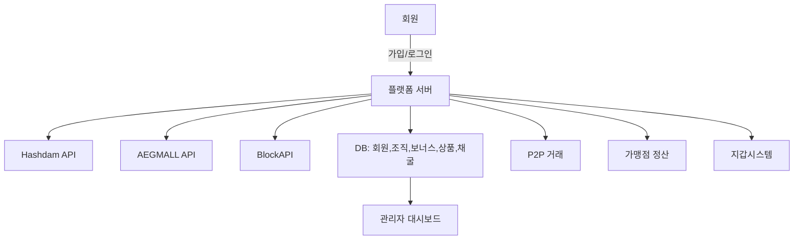

# 🧭 플랫폼 전산 시스템 명세서 (v1.0)

> 목적: 해시파워 기반 쇼핑/보상형 통합 플랫폼의 전산 구조 명세\
> 구성요소: 회원, 관리자, API 연동, 해시데이터 연동, 보너스/조직 구조, 지갑, 가맹점 정산

---

## 0. 목차

1. 회원 시스템
2. 외부 API 연동
3. 사용자 주요 기능
4. 관리자 시스템
5. 보너스 구조
6. 직급 조건
7. 보너스 출금 조건
8. 시스템 구성도 요약
9. 추가 보완사항
10. 가맹점 시스템(신규)
11. 권한별 메뉴 트리(역할별)
12. 역할별 사용자 시나리오
13. 부록 A: 용어 정의

---

## 1. 회원 시스템

### 1.1 가입 및 로그인

- **로그인 유형**: Google OAuth, Kakao Login, Apple Login
- **보안인증**
  - Cloudflare Turnstile: 로그인 / 회원가입 / 비밀번호 찾기에 적용
  - 2FA(추후 적용 가능)

### 1.2 회원정보 및 프로필

- 기본정보: ID, 닉네임, 이메일, 휴대전화
- 보안설정: 비밀번호 변경, 2FA, 로그인 이력
- 알림설정: 입금/출금 알림, 시스템 공지
- 출금주소 화이트리스트 관리(거래소 주소 포함)

---

## 2. 외부 API 연동

| 구분              | 내용                             |
| --------------- | ------------------------------ |
| **AEGMALL API** | 동일 ID 기준 Hashpower 자동 적립 수령    |
| **Hashdam API** | 해시 조회, 적립, 출금 처리               |
| **BlockAPI**    | BNB Chain 기반 Wallet, 토큰/NFT 관리 |

> **연동 원칙**: 표준 OAuth2/OIDC 또는 HMAC 서명, 요청/응답 표준화(JSON), 재시도/아이들포겟(幂等) 키 적용

---

## 3. 사용자 주요 기능

### 3.1 대시보드

- 나의 해시, 보너스, 채굴 코인별 잔액 요약
- 공지사항 / 이벤트 배너

### 3.2 지갑

- **암호화폐 지갑**: BNB 기반, BlockAPI 연동
- **포인트 지갑**: 적립/사용/출금 내역 표시

### 3.3 조직도

- 추천조직도(유니레벨)
- 후원조직도(바이너리, **스필오버**)
- 각 노드: 직급, ID, 이름, 좌/우 매출표시

### 3.4 보너스 내역

- 전체 보너스 합산
- 상세 구분: 추천보너스, 후원보너스, 공유보너스, 센터보너스, 센터추천보너스

### 3.5 쇼핑몰

- 상품리스트 / 상세보기 / 구매내역
- PV 및 보너스 자동 반영

### 3.6 가맹점

- 가맹점 리스트 및 개별 페이지
- 상품판매 / 정산내역 / 출금신청
- **내 매장 QR**(결제용), 주문내역, 환불요청 처리
- 매장별 직원계정(점장/캐셔) 권한 부여

### 3.7 채굴

- 해시내역(적립/소멸), 채굴율, 거절율
- 코인별 채굴내역(8종): LTC, DOGE, BELLS, LKY, PEP, JKC, DINGO, SHIC
- 출금내역 및 승인대기

### 3.8 고객지원

- 공지사항, 1:1 문의
- 이용약관 / 개인정보처리방침

###

---

## 4. 관리자 시스템

### 4.1 회원관리

- 전체 회원 리스트(닉네임, ID, 이메일, 추천ID, 직급 등)
- 직급별 / 센터별 / 정산중지 리스트
- 센터 자격 및 추천자격 수동 부여
- 추천코드: ID와 별도의 **자동 고유코드**

### 4.2 조직도 관리

- Canvas 기반 인터랙티브 조직도(줌/팬)
- 추천조직도: 유니레벨
- 후원조직도: 바이너리(스필오버)
- 노드 클릭 시 상세 정보(직급/매출/하위수) 표시

### 4.3 지갑관리

- 암호화폐 잔액 및 포인트 지갑 입출금 로그
- 출금 **승인/보류** 처리, 위험거래 탐지

### 4.4 가맹점관리

- 등록/승인/정산 내역 관리
- 상품별 PV, 보너스율 설정
- **가맹점 세부 권한**(점장/직원) 관리, 월말 자동정산 룰 설정

### 4.5 상품관리

- 등록 필드: 판매금액, PV(기본 \$100), 추천/후원/공유/센터/센터추천 보너스율
- 보너스 계산 자동 반영(거래 트랜잭션 기반)

### 4.6 정산/회계

- 가맹점 정산(일/주/월), 출금요청 승인, 수수료/세금 원천징수
- 매출/보너스/포인트 원장 리포트(다운로드)

### 4.7 P2P 거래 관리

- 신고/분쟁 티켓, 에스크로 강제 해제/환불, 수수료율 설정
- 의심거래 패턴 탐지(다계정, 동일IP, 비정상 빈번 거래)

---

## 5. 보너스 구조

| 구분      | 비율  | 조건            | 설명                                              |
| ------- | --- | ------------- | ----------------------------------------------- |
| 추천보너스   | 50% | 1\~10대        | 1대 30%, 2대 5%, 3대 5%, 4대 3%, 5대 2%, 6\~10대 각 1% |
| 후원보너스   | 20% | 1\~20대        | 1%씩 20레벨까지 지급(스필오버)                             |
| 글로벌공유   | 20% | D2 이상         | 전체 매출 기준 n/1 분배                                 |
| 센터보너스   | 8%  | D3 이상         | 회사 지정 센터에게 지급                                   |
| 센터추천보너스 | 2%  | D2 이상 + 센터추천자 | 센터를 추천한 회원에게 지급                                 |

> 📌 **모든 보너스는 무료회원 이상부터 지급**

### 5.1 보너스 계산·마감 프로세스

**실시간 적립 + 마감 후 사용/출금 가능** 정책

1. 주문 **확정(PAID)** → **즉시 보너스 적립**(지갑 *대기상태*)
2. 당일/주간/월간 **마감 배치**에서 확정(취소/환불 반영)
3. 마감 완료분을 **가용 잔액(사용/출금 가능)** 으로 전환
4. 정산 리포트 생성 및 이월 처리(미확정은 다음 회차로 이동)

> 마감 기준(주기/시각/타임존/지연일수)은 **환경설정**에서 변경 가능.

---

## 6. 직급 조건

| 직급   | 조건                 |
| ---- | ------------------ |
| 무료회원 | 단순 가입              |
| D0   | 추천 10명 또는 매출 \$200 |
| D1   | D0 × 2명            |
| D2   | D1 × 2명            |
| D3   | D2 × 2명            |
| D4   | D3 × 2명            |
| D5   | D4 × 2명            |

---

## 7. 보너스 출금 조건

1. **매출 발생 시 실시간 적립**되지만, **마감 완료 후**에만 출금/사용 가능
2. 누적 출금액은 총 매출의 **300% 한도**
3. 마감 기준과 지연일수(예: 환불 반영 D+2)는 **환경설정 > 정산/마감**에서 설정

---

## 8. 시스템 구성도 요약

---

## 9. 추가 보완사항 ✅

| 항목           | 설명                                                     |
| ------------ | ------------------------------------------------------ |
| 보안           | Turnstile + 2FA + IP 로그인 탐지(지오/디바이스 핑거프린트)             |
| 세션관리         | JWT(Access/Refresh) + 토큰 회전 주기 관리                      |
| 로깅           | API Log, Error Log, Transaction Log(감사 추적)             |
| 정산주기         | 일/주/월 자동 정산 배치 + 재시도 큐                                 |
| **보너스 마감정책** | **실시간 적립, 마감 후 사용/출금 가능**. 기준일/시각/타임존/지연일수 **환경설정** 가능 |
| 다국어          | 한/영 기본, 관리자에서 i18n 번역 키 관리                             |
| 백업           | 회원/지갑/보너스 DB 일일 자동백업 + 스냅샷                             |

## 10. 가맹점 시스템(신규)

### 10.1 핵심 화면(가맹점 주체)

- **가맹점 대시보드**: 오늘 매출/주문수/환불, 정산 예정액, 공지
- **상품 관리**: 상품 등록/수정, 재고, PV/보너스율 미리보기
- **주문 관리**: 실시간 주문, 결제 상태(성공/실패/환불), 영수증
- **결제 수단**: 포인트/코인 결제, QR 결제(매장 전용)
- **정산 관리**: 정산 주기 설정, 출금요청, 정산 리포트
- **직원/역할**: 점장/캐셔/뷰어 권한, 직원 초대/해제
- **API 키**: 파트너 연동용 키 발급/폐기, IP 화이트리스트

### 10.2 결제 흐름(오프라인 매장 예)

1. POS에서 금액 입력 → 2) **결제 QR 생성** → 3) 고객 앱 스캔 후 결제
2. 트랜잭션 승인 → 5) 포인트/보너스 적립 → 6) 가맹점 정산 대기

### 10.3 온보딩/심사

- 사업자 정보·대표자 신원 업로드 → 관리자 심사 → 계약서 전자서명 → 활성화
- 기본 수수료/정산 주기/보너스 반영 옵션 선택

---

## 11. 권한별 메뉴 트리(역할별)

### 11.1 사용자(회원)

- 대시보드 / 지갑(암호화폐·포인트) / 쇼핑 / 주문내역 / 조직도(추천·후원) / 보너스 / 채굴 / 가맹점(찾기) / 고객지원(공지·문의)

### 11.2 가맹점(점장/직원)

- 대시보드 / 상품 / 주문 / 정산 / 결제(QR) / 직원 / 설정(API 키, 웹훅, 세금정보)

### 11.3 관리자(운영·재무·CS)

- 회원 / 조직도 / 가맹점 / 상품 / 주문 / 지갑·출금 / 보너스 배치 / 정산 / 로그·리포트 / 시스템설정(i18n, 권한)

---

## 11-A. AEGMALL Inbound API (Provider → Platform)

외부 파트너(AEGMALL 등)가 Hashpower 적립 이벤트를 우리 플랫폼으로 전송하는 수신(API 제공) 사양.

### A.1 목적

- 기존 사용 방식 참고: `GET https://aeghash.com/api/from/?from=apollo&uid=sky.uav@gmail.com&app=&hash=2`
- 호환 유지를 위해 Legacy GET를 지원하되, 신규 표준은 **POST + HMAC** 권장.

### A.2 보안 원칙

- **IP 허용목록(Allowlist)**: 파트너별 승인된 출발 IP만 허용
- **HMAC-SHA256 서명**: `X-AEG-Signature: sha256=...` (원문: `timestamp nonce body`)
- **Idempotency-Key** 헤더 지원(중복 적립 방지), HTTPS 강제, 레이트리밋 적용

### A.3 엔드포인트

- 표준(권장): `POST /api/aegmall/v1/hashpower` (JSON, 헤더: X-AEG-Key, X-AEG-Signature, X-AEG-Timestamp, X-AEG-Nonce, Idempotency-Key)
- 레거시(선택): `GET /api/from/?from=&uid=&app=&hash=&key=&ts=&nonce=&sig=`

### A.4 관리자 환경설정(콘솔)

- 파트너 등록(from, 상태), api\_key/api\_secret 발급/회수
- 허용 IP 목록(CIDR), 레이트리밋/한도, 권한(적립/차감), 단위/한도 설정
- 로그/리포트(수신 이벤트, 서명검증, 적립결과), 실패건 재처리

---

## 11-B. 권한 및 액세스 매트릭스 (RBAC)

> 원칙: **최소 권한(Least Privilege)**, **역할 기반 접근 제어(RBAC)**, **행 단위 스코프(Row-Level Security)** 적용

### 권한 기호

- **R**: 조회(Read) / **C**: 생성(Create) / **U**: 수정(Update) / **D**: 삭제(Delete) / **A**: 승인(Approve) / **X**: 실행(Execute)

### 11-B.1 리소스 × 역할 매트릭스

| 리소스/기능          | 회원(User) | 가맹점-점장  | 가맹점-직원  | 관리자-운영 | 관리자-재무    | 관리자-CS | 시스템관리자  |
| --------------- | -------- | ------- | ------- | ------ | --------- | ------ | ------- |
| 내 프로필/보안        | R U      | –       | –       | R U    | R         | R      | R U     |
| 지갑(암호/포인트)      | R        | R       | R       | R U    | R U A     | R      | R U     |
| 출금 요청           | C        | –       | –       | R A    | R A       | –      | R A     |
| 주문(쇼핑)          | R C      | –       | –       | R      | R         | R      | R       |
| 가맹점 주문(오프라인)    | –        | R C U D | R C U   | R      | R         | R      | R       |
| 상품 관리(가맹점)      | –        | R C U D | R U     | R      | R         | R      | R       |
| 정산(가맹점)         | –        | R       | R       | R A    | R A X     | R      | R A X   |
| 조직도(추천/후원)      | R        | –       | –       | R U    | R         | R      | R U     |
| 보너스 보기          | R        | –       | –       | R      | R         | R      | R       |
| 보너스 배치 실행       | –        | –       | –       | X      | X         | –      | X       |
| AEGMALL 파트너 등록  | –        | –       | –       | –      | –         | –      | R C U D |
| API 키/허용 IP     | –        | –       | –       | –      | –         | –      | R C U D |
| 로그/리포트          | 내 것만 R   | 매장 범위 R | 매장 범위 R | R      | R X(다운로드) | R      | R X     |
| 시스템 설정(i18n/권한) | –        | –       | –       | –      | –         | –      | R C U D |

**스코프 규칙**

- **회원**: 본인 소유 데이터만(OWN) 접근. 조직도/보너스는 본인 영향을 받는 범위에 한함.
- **가맹점-점장/직원**: 소속 매장(MERCHANT\_ID) 범위로 행 제한. 점장은 직원 계정/권한 관리 가능.
- **관리자**: 역할별 도메인 스코프(운영=회원·상품·조직·보너스, 재무=정산·출금, CS=티켓·신고).
- **시스템관리자**: 전역(Global) 권한 + 보안 설정 변경 가능.

### 11-B.2 데이터 접근 제어(예시)

- **Row-Level Security**: `WHERE owner_id = current_user_id()` 또는 `merchant_id IN current_user_merchants()`
- **필드 마스킹**: 이메일/지갑주소 일부 마스킹(관리자-CS는 전체 열람 불가, 운영/재무만 필요 시 복호화 로그 기록)
- **출금 승인 2인 승인(Optional)**: 재무 A + 운영 A 동시 필요하도록 워크플로 옵션 제공

### 11-B.3 감사 및 알림

- **감사로그**: 권한 변경, API 키 발급/회수, 허용 IP 변경, 정산/출금 승인 이벤트 기록
- **알림**: 고위험 행위(대량 적립, IP 변경, 레이트리밋 초과) 발생 시 운영/보안 채널 웹훅

---

## 12. 역할별 사용자 시나리오 역할별 사용자 시나리오

### 12.1 사용자(회원) 시나리오

**시나리오 A: 매장 결제 & 보너스 적립**

1. 로그인 → 2) 지갑 잔액 확인 → 3) 오프라인 매장 QR 스캔 → 4) 결제 승인
2. PV 반영 → 6) 추천/후원/센터 보너스 계산 → 7) 내 보너스/주문내역 확인

**시나리오 B: 해시 상품 구매**

1. 쇼핑몰에서 해시 상품 선택 → 2) 결제 → 3) AEGMALL/Hashdam 연동으로 해시 적립
2. 채굴 내역 8종 표시 → 5) 출금 요청(조건 충족 시)

**시나리오 C: 조직 확장**

1. 추천코드 공유 → 2) 신규 회원 가입 → 3) 유니레벨/바이너리 배치(스필오버) → 4) 매출 반영

### 12.2 가맹점(점장/직원) 시나리오

**시나리오 D: 가맹점 온보딩**

1. 사업자 정보 제출 → 2) 관리자 승인 → 3) 정산 주기 설정 → 4) 매장 오픈

**시나리오 E: 오프라인 결제 처리**

1. POS에서 금액 입력 → 2) 결제 QR 생성 → 3) 고객 결제
2. 주문 성공 시 영수증 발행 → 5) 정산 예정액 증가 → 6) 이슈 시 환불 처리

**시나리오 F: 정산**

1. 월말 자동 정산 배치 → 2) 수수료·세금 공제 → 3) 가맹점 지갑으로 지급
2. 출금 요청 시 관리자 승인 후 송금

### 12.3 관리자 시나리오

**시나리오 G: 보너스 배치**

1. 당일 확정 주문 취합 → 2) PV 계산 → 3) 트리 탐색 후 보너스 분배
2. 지갑 적립 트랜잭션 생성 → 5) 실패 건 재시도 큐 처리

**시나리오 H: 위험거래 모니터링**

1. IP/디바이스 이상 로그인 탐지 → 2) 출금 보류 → 3) KYC 재확인 → 4) 해제

**시나리오 I: 가맹점 정산**

1. 기간 매출 집계 → 2) 수수료/세금 계산 → 3) 정산서 발행 → 4) 지급 처리

---

## 12. 역할별 사용자 시나리오 역할별 사용자 시나리오

### 12.1 사용자(회원) 시나리오

**시나리오 A: 매장 결제 & 보너스 적립**

1. 로그인 → 2) 지갑 잔액 확인 → 3) 오프라인 매장 QR 스캔 → 4) 결제 승인
2. PV 반영 → 6) 추천/후원/센터 보너스 계산 → 7) 내 보너스/주문내역 확인

**시나리오 B: 해시 상품 구매**

1. 쇼핑몰에서 해시 상품 선택 → 2) 결제 → 3) AEGMALL/Hashdam 연동으로 해시 적립
2. 채굴 내역 8종 표시 → 5) 출금 요청(조건 충족 시)

**시나리오 C: 조직 확장**

1. 추천코드 공유 → 2) 신규 회원 가입 → 3) 유니레벨/바이너리 배치(스필오버) → 4) 매출 반영

### 12.2 가맹점(점장/직원) 시나리오

**시나리오 D: 가맹점 온보딩**

1. 사업자 정보 제출 → 2) 관리자 승인 → 3) 정산 주기 설정 → 4) 매장 오픈

**시나리오 E: 오프라인 결제 처리**

1. POS에서 금액 입력 → 2) 결제 QR 생성 → 3) 고객 결제
2. 주문 성공 시 영수증 발행 → 5) 정산 예정액 증가 → 6) 이슈 시 환불 처리

**시나리오 F: 정산**

1. 월말 자동 정산 배치 → 2) 수수료·세금 공제 → 3) 가맹점 지갑으로 지급
2. 출금 요청 시 관리자 승인 후 송금

### 12.3 관리자 시나리오

**시나리오 G: 보너스 배치**

1. 당일 확정 주문 취합 → 2) PV 계산 → 3) 트리 탐색 후 보너스 분배
2. 지갑 적립 트랜잭션 생성 → 5) 실패 건 재시도 큐 처리

**시나리오 H: 위험거래 모니터링**

1. IP/디바이스 이상 로그인 탐지 → 2) 출금 보류 → 3) KYC 재확인 → 4) 해제

**시나리오 I: 가맹점 정산**

1. 기간 매출 집계 → 2) 수수료/세금 계산 → 3) 정산서 발행 → 4) 지급 처리

---

## 부록 A. 용어 정의(요약)

- **PV**: 보너스 계산 기준 값(가격과 연동 가능)
- **스필오버**: 상위 노드 포화 시 하위로 자동 배치되는 바이너리 배치 방식
- **센터**: 회사 지정 매출센터. 센터/센터추천 보너스 지급 대상
- **화이트리스트**: 인출 주소 사전 등록 및 지연 반영(보안 유예기간)
- **P2P 거래**: 회원 간 직접 거래. 플랫폼 에스크로가 자산을 잠시 보관하고, 조건 충족 시 릴리즈하는 **에스크로 기반 개인간 교환**
- **마감(Closing)**: 특정 주기/시간 기준으로 보너스/정산을 확정하는 절차. 마감 전 적립분은 **대기 상태**로 사용/출금 제한

---
